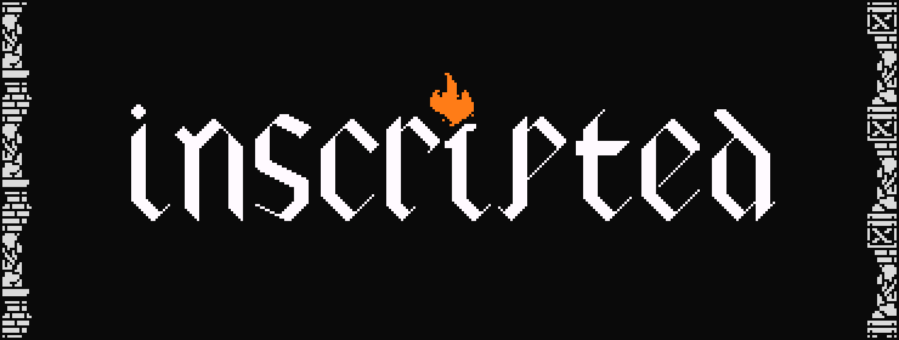

# Inscripted - Minecraft ARPG Server Website

A dark gothic-themed showcase website for the **Inscripted** Minecraft ARPG server plugin, inspired by Path of Exile and Tibia.



## Features

- **Dark Gothic Theme**: Black/white color scheme with striking orange accents
- **Fully Responsive**: Optimized for all devices from mobile to desktop
- **Interactive Animations**: Smooth scrolling, parallax effects, and hover animations
- **Accessible**: WCAG-compliant with keyboard navigation support
- **SEO Optimized**: Proper meta tags and semantic HTML structure

## Sections

1. **Hero Section**: Eye-catching banner with call-to-action
2. **Item System**: Showcase of Craftables and Relics
3. **Archetype System**: Detailed breakdown of Marauder, Gladiator, and Templar
4. **Developer**: About the creator with social links

## Tech Stack

- **HTML5**: Semantic markup
- **CSS3**: Custom properties, grid, flexbox, animations
- **Vanilla JavaScript**: No dependencies, pure performance
- **Custom Font**: Alkhemikal (gothic blackletter)
- **Google Fonts**: Cinzel, Libre Baskerville (fallbacks)

## Quick Start

### Standard Setup
Simply open `index.html` in your browser. No build process required!

```bash
# Clone and open
git clone https://github.com/amorabot/InscriptedWebsite.git
cd InscriptedWebsite
open index.html  # or double-click the file
```

### WSL Users
If you're using WSL, you need to run a local server (can't open files directly):

```bash
# Quick start
./view-site.sh

# Or manually
python3 -m http.server 8000
# Then open: http://localhost:8000
```

See `WSL-SETUP.md` for detailed WSL instructions.

## Deployment

This is a static website and can be deployed to:
- **GitHub Pages**: Enable in repository settings
- **Netlify**: Drag and drop the folder
- **Vercel**: Connect your repository
- **Any static host**: Upload the files

## Project Structure

```
InscriptedWebsite/
├── index.html          # Main HTML file
├── css/
│   └── styles.css      # All styles
├── js/
│   └── script.js       # Interactive features
├── assets/
│   ├── images/
│   │   ├── inscriptedlogo.png
│   │   └── pfp4.png
│   └── fonts/
│       ├── Alkhemikal.ttf      # Custom gothic font
│       └── alkhemikal.zip      # Original font package
└── README.md
```

## Customization

### Colors
Edit CSS variables in `css/styles.css`:
```css
:root {
    --color-accent-orange: #ff7733;
    --color-strength: #ff4444;
    --color-dexterity: #ffcc00;
    --color-intelligence: #44ccff;
}
```

### Content
All content is in `index.html` and can be edited directly.

## Browser Support

- Chrome/Edge (latest)
- Firefox (latest)
- Safari (latest)
- Mobile browsers (iOS Safari, Chrome Mobile)

## Links

- **Main Project**: [Inscripted](https://github.com/amorabot/Inscripted)
- **Discord**: [Join Community](https://discord.gg/SWnWghYRHr)
- **Developer**: [@amorabot](https://github.com/amorabot)

## License

MIT License - See [LICENSE](LICENSE) file for details

## Credits

**Developer**: Daniel Amorim (@amorabot)
**Inspired By**: Path of Exile, Tibia
**Design References**: Spellforged, Face.land

---

Built with passion for ARPG mechanics and deep itemization systems.
